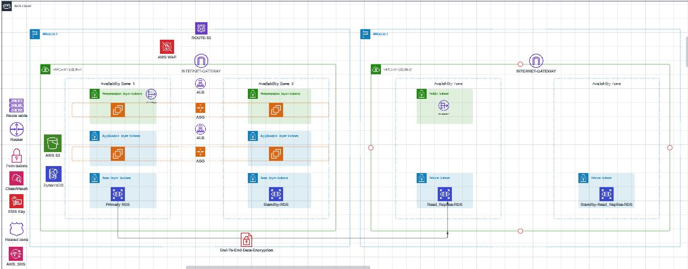

# 🏗️ AWS Three-Tier Architecture (A Scalable and Secure Web Application Architecture)



## 🌟 Introduction

Welcome to the world of scalable and secure web applications! 🚀 This guide will walk you through deploying a Three-Tier Architecture on AWS using Terraform. It's perfect for both beginners and experienced developers looking to create robust, modular, and maintainable applications.

## 🏛️ Architecture Overview

Our Three-Tier Architecture consists of three logical layers:

1. 🖥️ Presentation Layer
2. 🧠 Application Layer
3. 🗄️ Data Layer

Each layer has a specific job, making your application easier to manage and scale. Let's break it down!

### 🌐 Virtual Private Cloud (VPC) for Region-1

Think of the VPC as your own private playground in the cloud. It's where all the magic happens! Here's what's inside:

- 🧭 Route 53: Your traffic director, guiding users to the right place.
- 🛡️ WAF: Your digital bouncer, keeping the bad guys out.
- 🚪 Internet Gateway: The door to the internet for your VPC.
- ⚖️ Load Balancers: Traffic managers ensuring smooth operations.
- 🚨 CloudWatch Alarm & SNS Topic: Your app's health monitor and notification system.
- 🏦 Multi-AZ RDS Instances: Your fortified data vault.
- 🔐 KMS Key: The guardian of your data secrets.

Let's dive deeper into each layer:

#### 🖥️ Presentation Layer

This is where your users interact with your app. It includes:

- 🌐 NAT Gateway: Allows private resources to access the internet safely.
- 🚀 Launch Template & Auto Scaling Group: Ensures your app can handle any amount of traffic.

#### 🧠 Application Layer

The brains of your operation! This layer:

- Processes user requests
- Talks to the Data Layer
- Sends results back to the Presentation Layer

#### 🗄️ Data Layer

Your app's memory bank! This layer:

- Stores and retrieves data
- Handles all data-related operations
- Keeps your data safe and sound

## 🛠️ Prerequisites

Before we begin, make sure you have:

- 🔑 An AWS account with the right permissions
- 💻 Terraform installed on your local machine
- 🧠 Basic knowledge of AWS, Terraform, and networking concepts

## 📋 Requirements

| Name | Version |
|------|---------|
| 🌟 Terraform | >= 0.13 |
| ☁️ AWS Provider | >= 4.0 |

## 🏗️ Modules

We've created reusable modules to make your life easier! Check them out:

- 🔙 [Backend](https://github.com/stephennwachukwu/Terraform-Labs/tree/main/3-Tier-Arch/Backend)
- 🚨 [Cloudwatch Alarm](https://github.com/stephennwachukwu/Terraform-Labs/tree/main/3-Tier-Arch/modules/Cloudwatch_Alarm)
- 🔐 [KMS](https://github.com/stephennwachukwu/Terraform-Labs/tree/main/3-Tier-Arch/modules/KMS)
- 🛡️ [WAF](https://github.com/stephennwachukwu/Terraform-Labs/tree/main/3-Tier-Arch/modules/WAF)
- 💻 [Compute](https://github.com/stephennwachukwu/Terraform-Labs/tree/main/3-Tier-Arch/modules/Compute)
- ⚖️ [Load Balancer](https://github.com/stephennwachukwu/Terraform-Labs/tree/main/3-Tier-Arch/modules/Load-Balancer)
- 🌐 [Network](https://github.com/stephennwachukwu/Terraform-Labs/tree/main/3-Tier-Arch/modules/Network)
- 🗄️ [RDS](https://github.com/stephennwachukwu/Terraform-Labs/tree/main/3-Tier-Arch/modules/RDS)
- 🧭 [Route 53](https://github.com/stephennwachukwu/Terraform-Labs/tree/main/3-Tier-Arch/modules/Route_53)
- 📚 [RDS Read Replica](https://github.com/stephennwachukwu/Terraform-Labs/tree/main/3-Tier-Arch/modules/RDS_read_replica)

## 🚀 Deployment Steps

### Option 1: Multi-Team Deployment with Remote State Management

1. 📥 Clone the repository:
   ```
   $ git clone https://github.com/stephennwachukwu/Terraform-Labs.git
   $ cd ./Terraform-Labs/3-Tier-Arch
   ```

2. 📝 Edit the files in the modules to suit your needs.

3. 🔧 Set up remote state management:
   ```
   $ cd ./Terraform-Labs/3-Tier-Arch/Backend
   $ terraform init
   $ terraform plan
   $ terraform apply -auto-approve
   ```

4. 🏗️ Deploy the infrastructure (Into the base of the The Repository):
   ```
   $ cd ..
   $ terraform init
   $ terraform plan
   $ terraform apply -auto-approve
   ```

### Option 2: Deployment without Remote State Management

1. 📥 Clone the repository (same as Option 1).

2. 📝 Edit the modules to suit your needs (skip the Backend module).

3. 🏗️ Deploy the infrastructure:
   ```
   $ cd path/to/THREE-TIER-ARCHITECTURE
   $ terraform init
   $ terraform plan
   $ terraform apply -auto-approve
   ```

🕒 Be patient! The process might take about 25 minutes.

## 📚 RDS Read Replica Deployment (Optional)

Want to add an extra layer of data protection? Deploy a cross-regional Read Replica:

1. 🔍 Find your source DB instance ARN in the AWS console.

2. 📝 Edit the `RDS_read_replica` module files.

3. 🚀 Deploy the Read Replica:
   ```
   $ cd path/to/THREE-TIER-ARCHITECTURE/modules/RDS_read_replica
   $ terraform init
   $ terraform plan
   $ terraform apply -auto-approve
   ```

## 🏆 Conclusion

Congratulations! 🎉 You've just set up a robust, scalable, and secure Three-Tier Architecture on AWS. This setup will help you focus on building great applications without worrying about the underlying infrastructure. Happy coding! 🚀

## 📚 References

- [Terraform Docs](https://registry.terraform.io/providers/hashicorp/aws/latest/docs)
- [AWS Docs](https://docs.aws.amazon.com/)

Feel free to reach out if you have any questions or need help! Good luck with your awesome project! 😄
